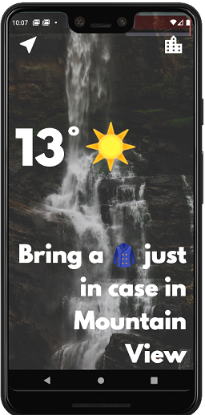

Flutter-weather-broadcasting-app
==
This repository is a weather broadcasting apllication created using Flutter. The weather information is acquired using API from openweathermap.org. Upon launch, the app will get the weather information from the location information from the device's GPS. The user can also manually input the city to get the weather broadcast.

## Dependencies
```yaml
dependencies:
  geolocator: ^5.1.4+2
  http: ^0.12.0+2
  flutter_spinkit: ^2.1.0
```
## Versioning
Version 1.0 (First deployment)
## Screenshot

## Issues
* Keyboard will cause pixels to be out of bounds on some phones

## To do list
* Method to back out if no location is acquired.
* Autofill or auto suggest city name
* Mutiple cities 
* hourly and one week broadcasts

## License

The contents of this repository are covered under the [MIT](LICENSE) License.

## Acknowledgments
Angela Yu's [Flutter Development Course](https://www.appbrewery.co/p/flutter-development-bootcamp-with-dart).

